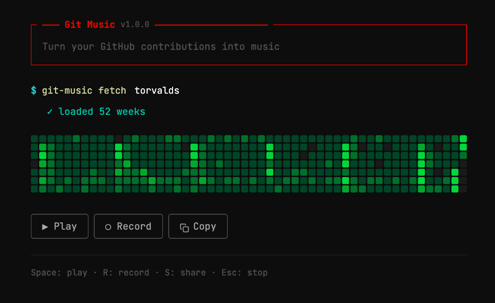

# Git Music

Turn your GitHub & GitLab contributions into music. 🎵

Git Music takes a username, automatically scans both **GitHub** and **GitLab** to find the most active profile, and turns your coding activity patterns into a unique, ambient musical sequence.



## Features

- **Multi-Platform Support**: Works with both GitHub and GitLab. Automatically detects which platform has more activity.
- **Ambient Audio Engine**: Uses [Tone.js](https://tonejs.github.io/) to generate soothing, reverb-drenched soundscapes based on your work habits.
- **Visualize & Listen**: Watch your contribution graph light up in sync with the melody.
- **Share**: Generate a clean, shareable link (e.g., `gitmusic.com/username`) that auto-resolves the correct platform for visitors.
- **Export**: Record and download a high-quality `.webm` or `.mp4` video of your graph playing.
- **Interactive**: Keyboard shortcuts for playback, recording, and sharing.

## Usage

1. Enter a GitHub or GitLab username.
2. Press **Enter** - the app will auto-detect your platform.
3. Press **Space** or click Play to listen to your year in code.

> **Tip**: Can't find the right profile? You can force a specific platform by typing:  
> `$ gitmusic fetch username -p gitlab`

### Keyboard Shortcuts

| Key | Action |
| --- | --- |
| **Space** | Play / Pause |
| **R** | Start / Stop Recording |
| **S** | Share (Copy Link) |
| **Esc** | Stop |

## Tech Stack

- **React** (Vite)
- **Tone.js** for audio synthesis (PolySynths, FMSine, Reverb)
- **Axios** for data fetching
- **GitHub Contribution API** (via [github-contributions-api](https://github.com/grubersjoe/github-contributions-api))
- **GitLab API** (via custom proxy)

## Development

```bash
# Install dependencies
npm install

# Run development server
npm run dev
```

## License

MIT
